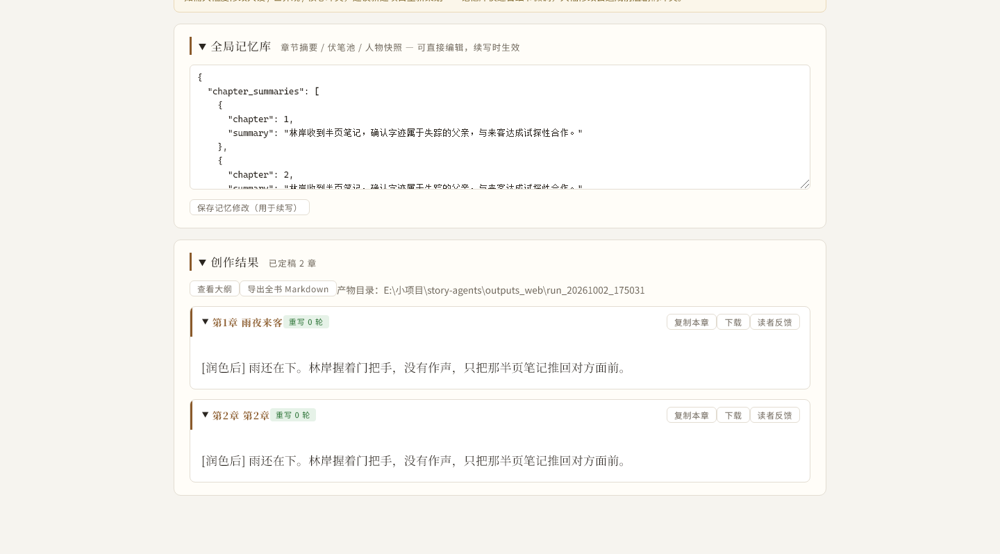

# 小说多 Agent 创作工坊

分工式多 Agent 流水线 + 评审回退：**策划（含场景节拍）→ 撰稿 → 三路并行校对（可打回重写）→ 润色（含去 AI 腔）→ 记忆结算**。
模型：DeepSeek API / 任意 OpenAI 兼容本地服务（LM Studio、Ollama 等）。框架：LangGraph。

## 核心特性

| 特性 | 一句话说明 |
|---|---|
| **场景节拍** | 策划不只给章节梗概，还拆出 3–5 个节拍（目标/冲突/转折/字数/情绪温度），撰稿按拍推进，长章不再前松后紧 |
| **三路并行校对** | 人物一致性、逻辑时间线设定、节奏篇幅各由一个 specialist 独立检查，额度专款专用，不再互相挤占 |
| **记忆按需检索** | 写第 N 章时不再带全书正文：**必带项**（未回收伏笔 + 人物快照 + 物资账本）按优先级截断、带上界，**检索项**用本章标题 + 梗概 + 节拍做 SQLite FTS5 检索取 top-k |
| **物资账本** | 策划给出开局清单（**可计数件数**：`5 瓶`而不是「约五天份」），逐章追踪消耗并对账。撰稿只能用账本内的东西，已耗尽/已丢失的明确禁止再出现；结算时件数变了不说原因、或"已耗尽"却还剩几件，都会告警——治「吃掉的压缩饼干下一章又摸出来」「两块饼干悄悄消失」这类长篇头号硬伤 |
| **伏笔状态机** | 伏笔有 open / progressing / deferred / resolved 四态，记录最后推进章节；连续多章没动静会自动提醒，防烂尾 |
| **去 AI 味** | 润色环节带去 AI 腔指令；另有纯代码的规则层体检（套话密度、句长节奏、比喻密度、收束句），只提示不擅自改稿 |
| **强类型约束** | 所有模型输出过 Pydantic，缺字段落默认值、中文枚举自动归一，脏数据不会打断流水线也不往下游传播 |

**稳定性工程**（同类项目的高频短板，这里都兜住了）：流式空闲超时、JSON 自动修复链 +
纠错重试、校对降级放行、Mock 全离线验证。


## 快速开始

```bash
# 1. 装依赖（隔离 venv 已装好可跳过）
pip install -r requirements.txt
# 想完全复现已验证过的版本：pip install -r requirements.lock.txt

# 2. 配置（可选）——网页端也能填，完全不配也能用 Mock 试跑
cp .env.example .env        # 填 DEEPSEEK_API_KEY；本地模型则改 DEEPSEEK_BASE_URL

# 3a. 网页端（推荐）
python -m uvicorn web.server:app --port 8765
# 浏览器打开 http://127.0.0.1:8765，表单里填 Key 或勾选 Mock 试跑

# 3b. 命令行
python main.py --prompt "一个关于旧堤防与家族秘密的悬疑故事" --chapters 3

# 无 Key 离线验证流转
python main.py --prompt "测试" --chapters 2 --mock
```

> 环境变量优先级：**真实环境变量 > `.env` > `config.py` 默认值**。
> 全部可用变量与取舍说明见 `.env.example`。
> 注意：网页端下拉里选好平台与模型后，`DEEPSEEK_MODEL` 就不再生效。

## 开发与测试

```bash
python -m pytest      # 195 项，全部离线，约 2.0 秒
```

测试不联网、不烧 token：`MockLLM` 能跑通整条流水线，JSON 修复链与规则层检测都是纯字符串处理。

| 测试文件 | 覆盖内容 |
|---|---|
| `test_json_repair.py` | JSON 修复链（逐个对应踩过的坑）、流式空闲超时 |
| `test_routing.py` | 图路由与回退、三路并行/汇合的图结构、节拍透传、分层记忆组装与必带项截断、物资账本渲染、章级计划兜底 |
| `test_pipeline_mock.py` | 端到端冒烟、三路校对各自 fail-open、伏笔状态机与超期告警、物资账本三态（改存量/标耗尽/新增）、角色名归一不裂条、风格体检落盘 |
| `test_models.py` | Pydantic 归一：缺字段、类型强转、中文枚举收敛、物资状态与角色名归一、告警去重 |
| `test_memory_index.py` | 中文 bigram 分词、FTS5 检索命中、单字虚词过滤、无索引时降级 |
| `test_style_check.py` | 套话/句长/比喻/收束句各自判据与样本量门槛 |

降级路径均已单独构造用例：校对单路超时只跳过该路、三路都无 critical 转 pass、
记忆结算失败不中断、检索不可用时退回「必带项 + 最近 k 章」。

**改 `llm.py`、`nodes.py`、`graph.py` 或 `models.py` 之前先跑一遍。**

## 网页端功能

- **预制选项**：性格/说话习惯/动机/恐惧/弱点/世界观等字段带下拉预制项（datalist），可点选也可手填；禁忌红线与禁止内容为可点选 chip 追加
- **AI 润色需求**：核心需求只言片语时一键扩写成完整需求（忠实保留用户信息，缺失维度保守补全），可一键还原
- **表单减负**：人物卡可勾选"由策划 Agent 自动设计"；一键填充示例；项目可保存/加载 JSON（不含 API Key）
- **实时看板**：当前 Agent 状态、重写计数（x/3）、打回原因逐条展示
- **断点续写 + 本机记忆**：填过的东西不用再填一遍，详见下方「数据存在哪」
- **结果面板**：章节折叠展示、单章复制/下载、导出全书 Markdown、查看大纲 JSON
- **加分项**：读者反馈 Agent（追读意愿评分）、只预览大纲（不写正文）、单次生成章节数上限 5



<sub>上面是跑完 2 章后的下半页：全局记忆库（可直接编辑，续写时生效）+ 创作结果（按章折叠、可单独复制/下载）。整页长图见 `docs/images/ui-full.png`。</sub>

## 数据存在哪（关掉再打开还在吗）

| 你的东西 | 存在哪 | 重开浏览器 | 重启服务 | 清了浏览器缓存 |
|---|---|---|---|---|
| API 平台 / 地址 / 模型 / Key | 浏览器 localStorage | 还在 | 还在 | 丢失（Key 要重填） |
| 创作表单（需求、人物卡、世界观、进阶项） | 浏览器 localStorage | 还在 | 还在 | 丢失 |
| 策划案 + 已定稿章节 + 记忆库 | 服务端 `outputs_web/_session.json` | 还在 | 还在 | 还在 |

- 打开页面会自动恢复：顶部出现「已恢复上次创作进度」提示条，直接点「续写下一章」接着写
  （复用策划案与记忆库，不会重跑策划 Agent）。
- 想写全新一篇 → 点「新建故事」：只清会话，`outputs_web/run_*/` 里的 md / json 不会被删除。
- 草稿落盘是防抖的（输入停止 0.7 秒后写一次），关页面前也会补存一次。
- API Key 默认记住在本机；公用电脑请把 Key 下方的「记住在本机」取消勾选，Key 就不落盘了
  （平台与模型名仍会记住）。

## 架构

```
START ─(无策划案)→ planner ─┐
      └(已有策划案)─────────┴→ chapter_planner → writer ─┬→ reviewer_ooc   ─┐
                                                         ├→ reviewer_logic ─┼→ merge_reviews
                                                         └→ reviewer_pacing ─┘        │
                                                                                      ├─(fail 且未超轮)→ bump_round → writer
                                                                                      └─(pass 或超轮)──→ polisher → memory_settler → END
```

> `chapter_planner` 只在「本章不在策划案范围内」时才动手（典型场景：续写超出了原案章数），
> 否则是空操作、不产生任何模型调用。重写循环（`bump_round → writer`）刻意绕开它。

> 三路校对并行写**各自独立的 state key**（`review_comments_ooc` / `_logic` / `_pacing`），
> 避免并行覆盖，最后由 `merge_reviews` 汇合判 verdict。

| Agent | 职责 | 输出 |
|---|---|---|
| 策划 Planner | 需求 → 梗概/人物卡/分章大纲/转折点 + **每章场景节拍** | 严格 JSON |
| 补纲 ChapterExtender | 本章超出策划案章数时，补一份分章大纲（标题/梗概/转折/节拍） | 严格 JSON |
| 撰稿 Writer | 按大纲与节拍写正文，收到反馈定向重写 | 正文 |
| 校对 `reviewer_ooc` | 只看人物一致性（性格/动机/禁忌） | JSON 清单 |
| 校对 `reviewer_logic` | 只看时间线、设定一致性、剧情逻辑 | JSON 清单 |
| 校对 `reviewer_pacing` | 只看节奏、注水、篇幅、节拍落实 | JSON 清单 |
| 汇合 `merge_reviews` | 合并三路意见（critical 排前），统一判定 verdict | 写入 `review_comments` |
| 润色 Polisher | 只改措辞节奏，不碰剧情与动机；附带**去 AI 腔** | 正文 |
| 记忆结算 MemorySettler | 章节摘要 + 伏笔状态 + 人物状态快照 + **物资账本变动** | JSON 增量（过 schema 校验） |

- **全局记忆**：策划案 + 故事记忆（State 持久跨章）。写新章时**不带全书正文**，只带：
  - **必带项**（漏掉会直接崩设定，不参与检索淘汰）：
    - **未回收伏笔**——按「有 deadline 的优先 → 最久没推进的优先」排序，
      超过 `MEMORY_MUST_HAVE_MAX`（默认 12）后截断；被截掉的**至少留下 id**，
      这样本章若涉及它们，记忆结算仍能推进 / 回收
    - **人物当前快照**
    - **物资账本**——可用的逐条列（带存量），已耗尽 / 已丢失的压成一行只报名字，
      起硬约束作用：「这些不能再用」
  - **检索项**：用本章标题 + 梗概 + 节拍当查询词，从历史摘要中取 top-k（`MEMORY_TOP_K`，默认 8）

  > **上界说明（实测修正后已收敛）**：检索项一直是硬上界（top-k）；
  > 必带项原先**没有**上限（实测 3 章攒 18 条伏笔，写第 4 章时必带项约 800 字、
  > 整段记忆上下文 1737 字），现已加截断。相对"全书正文进 prompt"是数量级改善，
  > 但要说准：必带项是**有上界的线性项**，不是常数项。

  检索走 **SQLite FTS5**（Python 标准库自带，零新依赖），中文用 bigram 分词规避
  FTS5 对中文不友好的问题；查询侧会滤掉「第」「章」这类单字虚词，
  否则一次命中一整片、bm25 区分度归零（实测该 bug 会让检索退化成"取最早的几章"）。
  已知边界：单字中文查询命中不了，详见 `memory_index.py` 的文档。
- **回退保护**：`MAX_REVISION_ROUNDS`（默认 3）防无限循环，超轮强制放行并保留意见。
- **禁止内容**：表单填的禁令同时注入撰稿（规避）、校对（核查）、润色三处。

### 数据流与持久化

```
用户表单 ──build_user_prompt / build_meta──▶ StoryState ──▶ 各节点读改写 ──▶ 定稿章节
                                                │
             ┌──────────────────────────────────┴───────────────────────────────┐
             ▼                                                                  ▼
   浏览器 localStorage                                          服务端 outputs_web/
   · storyagents.llm.v1   平台 / 地址 / 模型 / Key              · _session.json  策划案+章节+记忆
   · storyagents.form.v1  表单草稿（不含 Key）                  · run_*/         章节 md + final.md
```

**状态只有一份**（StoryState 由 LangGraph 在节点间传递），不存在"两套状态互相打架"。

进度与告警是**单向通道**，只推给前端、不写状态：

| 通道 | 触发时机 | 前端表现 |
|---|---|---|
| `llm.set_progress_cb` | 每收到一段流式输出 | 看板实时显示「已生成 N 字」 |
| `llm.emit_notice` | 见下 | 黄色告警条（`warn`）/ 蓝色提示条（`info`） |

`notice` 的触发点每处都对应一条「不中断流水线」的降级或提醒：

| 级别 | 时机 |
|---|---|
| `warn` | 某路校对结果无法解析 → 该维度跳过，章节继续 |
| `info` | 校对判定 fail → 列明各维度 critical 条数并打回 |
| `info` | 风格体检有提示 → 附套话/句长/比喻/收束句的各项读数 |
| `warn` | 记忆结算失败 → 本章照常定稿，后续章节缺这部分前情 |
| `warn` | 伏笔连续 ≥ `FORESHADOW_STALE_CHAPTERS` 章未推进 → 提醒防烂尾 |
| `warn` | 模型输出撞长度上限被截断 → 说明已从残缺内容尽量恢复 |
| `info` / `warn` | 续写超出策划案章数 → 已自动补写本章大纲（补写失败则退回兜底并告警） |
| `warn` | 策划给的物资没有可计数件数（「约五天份」）→ 提醒改成具体件数，否则后续逐章对账会反复打回 |
| `warn` | 物资账本对账异常（件数变了没说原因 / "已耗尽"却还剩几件）→ 已按更严格的一侧记录，请核对正文 |

模型输出里的脏数据（枚举写了中文、字段缺失、类型不对）由 `models.py` 归一并经
`emit_notice` 汇总上报，**去重后**只提醒一次，不会 50 条一起刷屏。

服务端存档落在四个时机：**planner 完成、每章定稿、全部完成、异常分支**。
写 `.tmp` 后 `os.replace` 原子替换——断电也不会留下半个文件。

## 目录

```
story-agents/
├── config.py          # API 配置、重写轮数、记忆/伏笔/去 AI 味各开关、.env 读取
├── state.py           # StoryState 全局共享状态
├── models.py          # Pydantic 模型层：策划案/校对意见/伏笔/记忆的 schema 与归一
├── memory_index.py    # 记忆检索（SQLite FTS5 + 中文 bigram 分词，零新依赖）
├── style_check.py     # 去 AI 味的规则层检测（套话/句长/比喻/收束句密度）
├── prompts.py         # 各角色的 System Prompt
├── llm.py             # LLM 封装（流式/超时/JSON 修复链）+ MockLLM 离线测试
├── nodes.py           # 节点实现（含 meta 材料注入、三路校对、汇合判定）
├── graph.py           # LangGraph 调度器 + 三路并行 + 回退路由
├── main.py            # CLI 入口
├── web/
│   ├── server.py      # FastAPI + SSE 进度推送 + 会话落盘/恢复
│   └── static/index.html  # 表单页（人物卡动态增删、本机记忆）
├── tests/             # pytest 测试集（离线，195 项，约 2.0 秒）
├── docs/
│   ├── 优化建议-对比同类项目.md   # 横向调研：能力矩阵 + P0–P3 清单
│   └── images/        # README 截图
├── _backup/           # 历史版本备份（不进 git），来源见其 README.txt
├── .env.example       # 环境变量样例与取舍说明
├── requirements.txt   # 依赖清单（顶层）
├── requirements.lock.txt  # pip freeze 精确版本
├── pyproject.toml     # 项目元信息（名称/许可/作者）+ pytest 配置
└── outputs_web/       # 网页端产物（不进 git）
    ├── _session.json  # 上次会话存档（策划案+章节+记忆），「新建故事」时清掉
    └── run_*/         # 每次运行的章节 md 与合稿
```

## 参考项目

**本轮已核实**（2026-10-02，含 README 与功能矩阵比对）；方括号内为本工程的采纳情况：

- **Narcooo/inkos**：记忆分「权威 JSON + 可重建的检索投影」两层，伏笔状态机带 schema 校验。
  memory_settler 是其简化版；检索投影〔已落地：`memory_index.py`，含中文 bigram 分词〕。
  未跟进的一点——inkos 对脏数据是**拒绝**，本工程改**归一 + 告警**（`models.py`）。
- **HuangLeijiana/novel-agent**：12 Agent；阶段级人类确认（`interrupt()`）；按 Agent 分级选模型。
  〔均未落地，见「已知边界」〕
- **14790897/Novel-Factory-Multi-Agent**：场景节拍（Scene Beats）把粗纲扩成场景；联网检索文风并提炼 brief。
  〔场景节拍已落地；联网检索文风未做〕
- **bodinggg/LangGraph-based-Novel-by-Agents**：Supervisor 编排 4 个 specialist 并行检查；检查点断点恢复。
  〔多路并行已落地：三路 specialist + merge 汇合；检查点恢复未做〕
- **MaoXiaoYuZ/Long-Novel-GPT**：大纲→章节→正文三段扩写控篇幅；实时显示调用费用。
  〔费用统计未做〕
- **YILING0013/AI_NovelGenerator**：语义检索注入历史细节 + 一致性检查器。
  〔已落地：FTS5 全文检索版（非向量）+ 三路一致性校对〕

**尚未复核**（引用自其他项目 README 或社区横评，未亲自验证）：

- `voocel/ainovel-cli` —— 卷弧滚动规划（长篇远期大纲不空洞）
- `wanqili857-byte/fictionforge` —— 质量门禁（禁词 / AI 腔）、修订回流

## 已知边界（下一步可做）

完整调研、能力矩阵与按优先级排序的优化清单见
**[`docs/优化建议-对比同类项目.md`](docs/优化建议-对比同类项目.md)**（25 条建议，每条含落点文件）。

**已完成**（P0 + P1，2026-10-02）：

- ✅ 章内「场景节拍」层——策划拆到 3–5 拍，撰稿按拍推进（原建议第 4 条）
- ✅ 记忆检索化——SQLite FTS5 + 中文 bigram 分词，必带项与检索项分层（第 5 条）
- ✅ 伏笔状态机——四态 + 最后推进章节 + 超期巡检（第 6 条）
- ✅ 校对拆分——三路 specialist 并行 + 汇合判定（第 7 条）
- ✅ 去 AI 腔——润色指令 + 规则层体检（第 8 条）
- ✅ Pydantic 强类型约束——`models.py` 统一归一（第 9 条）

**首次真模型三章实跑暴露的三个问题**（2026-10-02，产物见 `outputs_web/run_20261002_204203/`）
——**均已修复**。留在这里是为了说明这些坑真实存在过、以及修的是什么：

1. **没有物资/道具账本** → 已补（`models.Item` / `MemoryDelta.item_changes`）。
   原症状：3 章里 2 章因物资矛盾被打回，烧掉 3 轮重写；更糟的是第 1 章的背包清单
   自身就与后文矛盾（列了 4 件却没列罐头，紧接着"手摸到罐头"），而第 1 章 0 轮重写通过，
   内伤被当成正典固化。现在：策划先给 `initial_items` 立账 → 撰稿 prompt 必带账本
   （已耗尽 / 已丢失单列一行、明令禁止再用）→ 逻辑校对专项核对物资 →
   结算合并 `item_changes`。其中「只改存量的条目不得把状态重置回 available」
   有专门用例守着——那是账本最容易失守、也最要命的一处。
2. **必带项无上限** → 已加上界（`MEMORY_MUST_HAVE_MAX`，默认 12）。
   截断按「deadline 近 > 最久没推进」排序，被省略的**至少留下 id**。
   同时收紧 `MEMORY_SYSTEM`：伏笔必须"后文有账可算"，
   明确排除「猫蹭手背」「雨停」这类不会有下文的动作与氛围，且每章新增 ≤ 2 条。
3. **同一角色在人物快照里裂成多条** → 已归一（`models.canon_name`）。
   精确匹配失败后按「去括号备注 → 去空白标点 → 转小写」再匹配，
   命中则保留账本里的原名（避免名字漂移）；结算请求里附上当前人物名单，
   要求 `character_updates` 的 name 从名单中取——从源头少犯，而不是只靠事后收拾。

**第二次实跑暴露的两个问题**（2026-10-02 第 4 章续写，同一产物目录）——**均已修复**：

1. **续写超出策划案章数 → 本章没标题、没大纲** → 已补节点 `chapter_planner`。
   原症状：需求写着"共3章"，写完第 3 章又续写第 4 章，而 `outline.chapters` 只有 3 条，
   `_chapter_plan()` 匹配不到就走兜底分支，第 4 章落盘标题成了 `# 第4章`，
   正文也没有分章梗概，全靠"上一章全文 + 核心冲突"自由发挥。
   现在：入口先过 `chapter_planner`，发现本章不在策划案内时，用「策划案 + 已定稿章节标题
   + 上一章结尾」补一份大纲写回 `outline.chapters` 并推 notice 告知；
   补写失败则退回原兜底，但**必须告警**——不再无声降级。
   之所以不塞进 `_chapter_plan()`：那个函数每章要被调用 7 次（撰稿 1 + 三路校对 3 +
   汇合 1 + 润色 1 + 结算 1），在里面发 LLM 请求会把同一章规划出好几份不同的大纲。
2. **改完代码不重启 = 一直在测旧代码** → `start.bat` 已加醒目提示。
   原症状：`start.bat` 检测到 8765 被占用时**只打开浏览器然后退出**，而它启动的
   uvicorn 不带 `--reload`；于是"改完代码再跑一遍"其实是在旧进程上又跑了一遍。
   本次第 4 章就是这样：产物 `memory.json` 里连 `items` 键都没有、橘猫仍是 3 条并存
   ——上面第 1 条与下面第 3 条修复根本没被执行到。
   **排查手法**：先看产物 schema（有没有新字段）比看运行日志有用得多。

**第三次实跑暴露的两个问题**（2026-10-02 网页端全新创作，两次尝试的产物目录都是空的）
——**均已修复**：

1. **刚打出「策划完成」就「出错中断」**：`TypeError: 'NoneType' object is not iterable`。
   根因不在业务节点，而在消费端：LangGraph 在 `stream_mode="updates"` 下，对
   **一个字段都没写**的节点上报的是 `{node: None}`，而不是空字典——而本项目存在
   「合法空操作」节点（`chapter_planner` 发现本章已在策划案内时 `return {}`、
   `memory_settler` 结算失败降级时 `return {}`）。`web/server.py` 原先直接
   `state.update(delta)`，于是 `dict.update(None)` 抛错，整条流水线当场断掉，
   一章都没写出来（run 目录一片空白）。
   修法：把守卫做成 `_merge_update()` 放在**消费端**——`return {}` 表示「本次不更新」
   是正确语义，消费端本来就不该假设 delta 一定是 dict。
   **为什么离线测试当时全绿**：CLI（`main.py`）走 `app.invoke`，根本不经过
   「逐节点消费 updates」这条路径，踩不到。现已由 `tests/test_stream_update.py`
   复刻该路径钉死；其中一项专门断言 LangGraph 确实会上报 `None`，
   免得这层守卫日后被当成"多余的防御"删掉。
2. **「确认清空」的提示挂在页面顶端，点了等于没反应** → 确认框改为铺满视口的模态。
   原症状：`#confirmBar` 是文档流里的一条横幅，位于页面最顶部，而「开始创作」按钮
   在页面底部——用户点下去看不到任何反馈，要手动滚到顶部才发现有提示。
   现在：`position:fixed; inset:0` 的模态层（实测铺满可见视口、弹窗居中，
   与滚动位置无关），支持 ESC 与点背景取消，默认焦点落在「取消」
   （不可逆操作的安全侧），确认按钮文案可定制（「清空并开始新故事」）。
   触发条件也从 `hasSession && 页面上有章节` 放宽为 `页面上有章节 || 服务端有存档`
   ——原条件漏了「服务端有存档但页面还没恢复出来」那一档，照样覆盖进度却不吭声。

**第四次实跑暴露的两个账本问题**（2026-10-02 真模型 3 章 + 续写 1 章，产物见
`outputs_web/run_20261002_225256/`）——**均已修复**。
先说清楚前提：这一轮 P1 的三个修复**确实生效了**（账本有 5 条真实状态流转、人物快照
恰好 4 条不裂、第 4 章标题是《台阶没顶之后》）。但**新问题把重写轮次烧光了**：
7 个重写轮次里 ch2 / ch3 各撞到 3 轮上限，约六成 critical 是账目类。
所以下面这两条是"凭空多物被止住之后**迁移出来的新形态**"——不是修复失效，是下一个瓶颈。

1. **账本 `qty` 不可对账 → 撰稿与校对每章各算一个数** → 已给账本加可计数件数
   （`Item.count` / `unit`，`ItemChange` 同步）。
   原症状：策划给的 `initial_items.qty` 是「约五天份」「半袋」「约两周份」这类自由文本，
   撰稿人每章都得自己换算成瓶/块，于是每章算出不同的数、逻辑校对每章都报。
   现在：策划必须直接给 `count`（整数）+ `unit`（瓶/块/罐），模糊描述挪进 `qty`；
   撰稿 prompt 明令「账本件数是权威口径，不要自己把'五天份'换算成别的数」；
   逻辑校对把「数量与账本对不上且无交代」判 critical；策划若仍给模糊量，入口会告警
   （**不替它猜**——猜出来的数字比没有数字更糟，会立刻触发误报）。
   程序侧再兜一层：只给描述没给件数时，从**描述开头**提取（「六块」→ 6），
   提取不到一律留 `None` 且**不填 0**（`None` 表示"数不清"，拿去加减立刻算错）。
   锚定开头是刻意的：否则「约五天份，每天一瓶」里的"每天一瓶"会被当成存量 1 瓶。
2. **结算静默采信本章数字 → 差额被悄悄吞掉** → 已改为逐件对账 + 告警。
   原症状：ch2 末写 4 块饼干，ch3 正文只剩 2 块且没交代去向，校对连报两轮都没改掉，
   账本最终落成「压缩饼干 2块 / status=consumed」——**"已耗尽"却还剩 2 块，
   字段语义自相矛盾**。
   现在：结算比对「账本上一章的件数」与「本章结算给出的件数」，
   **件数变了却没说原因就推 warn**（写明原因则安静——要抓的是"静默"，不是"变化本身"，
   否则会逼出无意义的重写）；同一条里既标 consumed / lost 又给正数件数，判为自相矛盾，
   件数按 0 处理并告警。

**顺带修掉的检索退化**：`memory_index` 原先会把「第」「章」这类单字虚词当关键词提交，
可它们几乎出现在每条摘要里，一命中就是一整片，bm25 区分度归零。
实测症状：查「第16章 …」时 8 条命中全是第 1–8 章——等于把"按相关度检索"
悄悄换成了"取最早的几章"。现已过滤；检索未命中时退回「必带项 + 最近 k 章」。

**尚未做**：

1. **工程化**：缺 Docker / 容器化、按 Agent 分级选模型、token 与费用统计
2. **交互**：无中途人工干预（人工确认/改稿后再续），当前是「一键跑完」
3. **多书并行**：`config` 为进程级单例，网页端同一时间只能写一本（已加锁）
4. **人物仍是提示词级约束**（人设卡 + 禁忌 + 快照），非独立 agent
5. **人物禁忌压不住**：连续四章被三路校对报同一件事（内心独白过多 vs「惜字如金」人设），
   第3章已升级为 critical。撰稿提示词对角色禁忌的强调力度需要加强。
   （第 4 章那次跑在旧代码上，但角色禁忌这一段提示词前后未改，结论仍成立。）
6. **缺「设定档案」→ 逻辑校对会误报**：地点、物理设定（"店面卷帘门 + 后门铁门"）
   不属于伏笔 / 人物 / 物资任何一本账；前情摘要只记情节，top-k 又只带上一章，
   于是校对手里没有判断"与前文一致"的依据。第 4 章实测：它连着两轮把
   「便利店卷帘门在落」判成 critical 设定矛盾，而第 1 章早已建立那两扇门
   （正文没按它改是对的）。下一步应把「已确立设定」做成第四本必带账。
7. **落盘 md 双标题**：程序会拼一个 `# {title}`，而模型正文又自带 `# 第N章 {title}`，
   于是每章文件开头有两个一级标题，`final.md` 同理（四章通病，非补纲引入）。

## 许可与致谢

**本项目代码采用 MIT License**，版权 © 2026 Bolumaile。你可以自由使用、修改、
再分发、闭源商用，只需在副本中保留版权声明与许可原文。详见 [`LICENSE`](LICENSE)。

### 第三方资源

- **字体**：`web/static/fonts/` 下的三款字体（思源黑体 / 思源宋体 / 拉丁 Noto Serif，
  共 210 个 woff2 分片）采用 **SIL Open Font License 1.1**，**不适用**上述 MIT 许可。
  版权分属 Adobe 与 The Noto Project Authors；完整许可原文、各字体版权行与版本号见
  [`web/static/fonts/LICENSE-OFL.txt`](web/static/fonts/LICENSE-OFL.txt)。

  OFL 允许商用与再分发，但要求随字体保留版权声明与许可文本。该文件**必须随
  `fonts/` 目录一同分发**，请勿删除或单独摘出字体文件使用。

- **运行依赖**：LangGraph、FastAPI、OpenAI SDK 等，均为宽松许可
  （MIT / Apache-2.0 / BSD），精确版本见 `requirements.lock.txt`。

> ⚠️ `web/static/fonts/yinpin-hongmengti.ttf`（印品鸿蒙体）为**非商用授权**字体，
> 已列入 `.gitignore`、不随仓库分发，代码与 CSS 中也不再引用。请勿将其用于商业用途，
> 发布前建议从本地直接删除。
